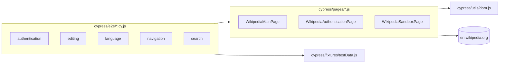

# Wikipedia Cypress Test Automation Framework

[](https://github.com/testomut/WikiAutoTestsCypress/actions/workflows/cypress.yml)


A reference Cypress automation framework demonstrating scalable UI test
architecture, reusable page abstractions, cross-platform execution, CI
integration, and maintainable reporting — exercised end-to-end against
the live [en.wikipedia.org](https://en.wikipedia.org).

> **Origin note:** this project started in 2024 as a short technical
> assignment (5 specs, a basic Page Object Model). It has since been
> audited and reworked (see [`AUDIT.md`](./AUDIT.md)) into the reference
> framework described below — restructured layout, linting/formatting,
> CI, dependency and security hardening, and this documentation set.
> It is a **portfolio/reference project**, not a production test suite
> for a company-owned application; see [Limitations](#limitations)
> before treating it as one.

## Table of contents

- [Purpose](#purpose)
- [Engineering highlights](#engineering-highlights)
- [Tech stack](#tech-stack)
- [Architecture](#architecture)
- [Folder structure](#folder-structure)
- [Test coverage](#test-coverage)
- [Getting started](#getting-started)
- [Commands](#commands)
- [Running locally](#running-locally)
- [Running in CI](#running-in-ci)
- [Reports](#reports)
- [Design decisions](#design-decisions)
- [Stability strategy](#stability-strategy)
- [Limitations](#limitations)
- [Roadmap](#roadmap)
- [Documentation](#documentation)
- [Author](#author)
- [License](#license)

## Purpose

This suite exercises core Wikipedia user journeys — search, navigation,
language switching, authentication, and article editing — as a
concrete demonstration of how to structure a maintainable Cypress
framework: a real Page Object Model, shared utilities instead of
copy-pasted DOM workarounds, environment-based secrets, linting/CI
gates, and documentation that states tradeoffs rather than hiding them.

## Engineering highlights

- **Page Object Model with no leaked selectors** — every spec reads
  like a user story; all DOM interaction lives in `cypress/pages/`.
- **Shared utilities over duplicated workarounds** — the "click, then
  handle an optional modal" pattern that appeared independently in two
  page objects was extracted into `cypress/utils/dom.js` once, not
  copy-pasted.
- **Test data separated from test logic** — search terms, language
  codes, and edit text live in `cypress/fixtures/testData.js`, so new
  scenarios can be added without touching page objects.
- **Cross-platform by construction** — no `cmd.exe`-only or GNU-only
  shell syntax anywhere in `package.json`; every script runs
  identically on Windows, macOS, Linux, and GitHub Actions.
- **Secrets never committed** — credentials are read via
  `Cypress.env()`, sourced from a gitignored `cypress.env.json` locally
  or from CI secrets; see [`SECURITY.md`](./SECURITY.md).
- **CI-gated quality bar** — every push/PR runs ESLint, a Prettier
  format check, and the full Cypress suite, with videos, screenshots,
  and the Mochawesome report captured as artifacts.
- **Documented, not hidden, tradeoffs** — the one remaining fixed
  `cy.wait()` and the two full-sentence copy assertions are explained
  in [Stability strategy](#stability-strategy), not silently left in
  place or silently "fixed" with unverified guesses.

## Tech stack

| Layer              | Choice                                                                                  |
| ------------------ | --------------------------------------------------------------------------------------- |
| Test runner        | [Cypress](https://www.cypress.io/) 15                                                   |
| Language           | JavaScript (ES modules) + JSDoc type annotations                                        |
| Reporting          | [cypress-mochawesome-reporter](https://github.com/LironEr/cypress-mochawesome-reporter) |
| Linting/formatting | ESLint (flat config) + `eslint-plugin-cypress`, Prettier                                |
| CI                 | GitHub Actions                                                                          |

## Architecture

Full rationale in [`ARCHITECTURE.md`](./ARCHITECTURE.md). Summary:



Specs never touch selectors or raw Cypress commands directly — they
read as scenarios, delegating all DOM work to page objects. Page
objects share DOM-probing logic via `utils/`, and specs pull literal
test data from `fixtures/testData.js` instead of inlining it.

## Folder structure

```
cypress/
  e2e/            # 5 spec files - one per user journey
  pages/          # Page Object Model classes
  utils/          # Shared DOM helpers (e.g. optional-dialog handling)
  fixtures/       # Static test data (search terms, language codes, edit text)
  support/        # Global Cypress hooks/setup
.github/workflows/cypress.yml   # CI: lint, format check, test, artifacts
cypress.config.js
eslint.config.js
.prettierrc
```

## Test coverage

| Spec                   | Scenarios                                                                                                                          |
| ---------------------- | ---------------------------------------------------------------------------------------------------------------------------------- |
| `authentication.cy.js` | Successful login, wrong username, wrong password, logout                                                                           |
| `search.cy.js`         | English article, non-English/Unicode query, 300-char query, special characters, numeric query, mixed query                         |
| `editing.cy.js`        | Save with text/numbers/special characters, cancel editing, save without a summary, edit-summary character limit                    |
| `language.cy.js`       | Switch to a language with a full article, switch to one without an article, switch across several languages, switch back and forth |
| `navigation.cy.js`     | Homepage → article link, logo → homepage, view source, view history                                                                |

19 `it()` scenarios across 5 specs, all independent (each visits its
own starting page in `beforeEach`, no shared mutable state between
tests).

## Getting started

**Prerequisites:** Node.js ≥ 22, npm.

```bash
git clone https://github.com/testomut/WikiAutoTestsCypress.git
cd WikiAutoTestsCypress
npm ci
```

### Environment setup

The authentication spec needs Wikipedia credentials. Copy
[`.env.example`](./.env.example) for the two supported options
(gitignored `cypress.env.json` locally, or `CYPRESS_`-prefixed
environment variables in CI). **Use a disposable test account you
don't mind losing** — never a personal or production Wikipedia
account. See [`SECURITY.md`](./SECURITY.md).

## Commands

| Command                | What it does                                                |
| ---------------------- | ----------------------------------------------------------- |
| `npm run lint`         | ESLint over the whole repo                                  |
| `npm run lint:fix`     | ESLint with autofix                                         |
| `npm run format`       | Prettier, writes changes                                    |
| `npm run format:check` | Prettier, check-only (used in CI)                           |
| `npm run clean`        | Remove generated `cypress/reports`, `screenshots`, `videos` |
| `npm run cypress:open` | Open the Cypress GUI runner                                 |
| `npm run cypress:run`  | Headless run of the full suite                              |
| `npm test`             | Alias for `cypress:run` (cleans previous reports first)     |
| `npm run test:open`    | Alias for `cypress:open`                                    |
| `npm run test:headed`  | Headless runner but with a visible browser window           |
| `npm run test:ci`      | Lint, then headless run — what CI executes                  |
| `npm run report`       | Print the path to the generated Mochawesome HTML report     |

## Running locally

```bash
npm run cypress:open   # interactive, pick a spec, watch it run
# or
npm test                # headless, all specs, generates the HTML report
npm run report           # prints the report path to open in a browser
```

## Running in CI

[`.github/workflows/cypress.yml`](./.github/workflows/cypress.yml) runs
on every push and pull request: Node 22 via `actions/setup-node` (with
npm caching), `npm ci`, a cached Cypress binary, lint, format check,
then the full headless suite. Videos and the Mochawesome report are
uploaded as artifacts on every run; screenshots are uploaded on
failure.

**Setup required:** the workflow reads `CYPRESS_WIKI_USERNAME` and
`CYPRESS_WIKI_PASSWORD` from repository secrets
(Settings → Secrets and variables → Actions). Until those are added,
the authentication spec will fail in CI — this is expected, not a bug
in the workflow.

## Reports

A single reporter (`cypress-mochawesome-reporter`) generates one merged
HTML report per run under `cypress/reports/html/index.html`, with
screenshots embedded inline — no separate merge/generate step, unlike
the project's original multi-reporter setup (see
[`AUDIT.md`](./AUDIT.md) C2). Locally, run `npm test` then `npm run
report` for the path. In CI, download the `mochawesome-report`
artifact from the workflow run.

## Design decisions

- **JavaScript + JSDoc, not TypeScript.** At 5 specs and 3 page
  objects, a TypeScript build step would add tooling surface without
  a real payoff at this size. JSDoc gives editor type hints on page
  object methods for a fraction of the cost. Full reasoning in
  [`ARCHITECTURE.md`](./ARCHITECTURE.md).
- **One reporter, not three.** The original config layered
  `cypress-mochawesome-reporter`, `cypress-multi-reporters`, and a
  manual `mochawesome-merge`/`marge` pipeline, with a duplicate
  `reporter` key silently picking a winner. Consolidated to one
  reporter that merges its own output.
- **`pages/` + `utils/` + `fixtures/`, not a deeper layered
  architecture.** A base-page class, a locator-repository layer, or a
  custom-command DSL would be over-engineering for 3 page objects —
  added only if the suite grows enough to justify it.

## Stability strategy

Tests against a live, third-party, real-world site cannot be made
fully deterministic — this section is intentionally specific about
where that shows up, rather than claiming it's solved:

- **One remaining fixed wait.** `WikipediaMainPage.switchLanguage()`
  has one `cy.wait(500)`, inline-commented and lint-suppressed with a
  reason: the language menu's open animation has no queryable "done"
  state (no class flip, no event) to assert on instead.
- **Two assertions on exact MediaWiki copy.** `verifyFailedLogin()` and
  `verifyArticleDoesNotExist()` check literal UI strings owned by
  Wikipedia/MediaWiki, not this project. `verifyFailedLogin()` also
  asserts a structural signal (URL stays on the login page) so a
  wording change alone doesn't flip a real pass into a false failure
  on that check — but the text assertion is deliberately kept because
  wording _is_ part of what's being verified.
- **CI-only retry, scoped and documented.** `retries.runMode = 1` in
  `cypress.config.js` mitigates transient failures from the live site
  itself, only in headless/CI runs — `cypress open` never retries, so
  failures stay immediately visible during development. This is not a
  substitute for the selector/assertion work above.
- **External, shared state.** `editing.cy.js` writes to the real,
  public `Wikipedia:Sandbox` page. Each save uses a timestamped unique
  string to avoid colliding with a previous run's leftover text, but
  the suite cannot control when Wikipedia itself clears that page.

## Limitations

- This is a **portfolio/reference project**, not a production test
  suite guarding a real deployment pipeline — there is no
  product team, no on-call rotation, and no SLA behind it.
- It exercises a live third-party site with no staging/mock
  environment; outages, A/B UI experiments, or Wikipedia layout
  changes can fail specs with no code defect involved.
- `authentication.cy.js` and `editing.cy.js` will fail in CI until the
  `CYPRESS_WIKI_USERNAME`/`CYPRESS_WIKI_PASSWORD` secrets are
  configured on the GitHub repository (see
  [Running in CI](#running-in-ci)).
- No visual regression, accessibility, or performance testing —
  functional UI coverage only.
- The GitHub Pages report link below reflects a snapshot from the
  project's earlier version, not an auto-published latest run; the
  CI workflow currently uploads reports as artifacts rather than
  publishing to Pages (see [Roadmap](#roadmap)).

## Roadmap

- [ ] Auto-publish the Mochawesome report to GitHub Pages from CI on
      `master`, replacing the current static snapshot in `docs/`.
- [ ] Add a `cy.session()`-based login helper if a spec ever needs an
      authenticated precondition rather than testing login itself.
- [ ] Component-level or API-level checks if the suite grows beyond
      UI-only coverage.

## Documentation

- [`AUDIT.md`](./AUDIT.md) — the pre-rework audit this project was
  built from
- [`ARCHITECTURE.md`](./ARCHITECTURE.md) — structure, layers, and the
  reasoning behind each decision
- [`SECURITY.md`](./SECURITY.md) — credential handling, disclosure
- [`CONTRIBUTING.md`](./CONTRIBUTING.md) — local workflow, commit/PR
  expectations
- [`CHANGELOG.md`](./CHANGELOG.md)
- [`GITHUB_SETUP.md`](./GITHUB_SETUP.md) — recommended repo
  description/topics

## Author

**Stanislav Mokshyn** — [github.com/testomut](https://github.com/testomut)

## License

[MIT](./LICENSE)
